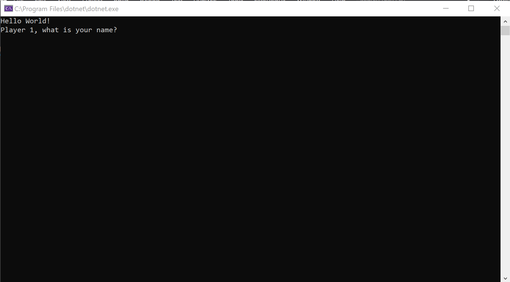
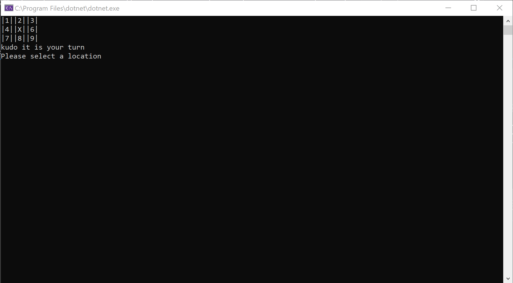
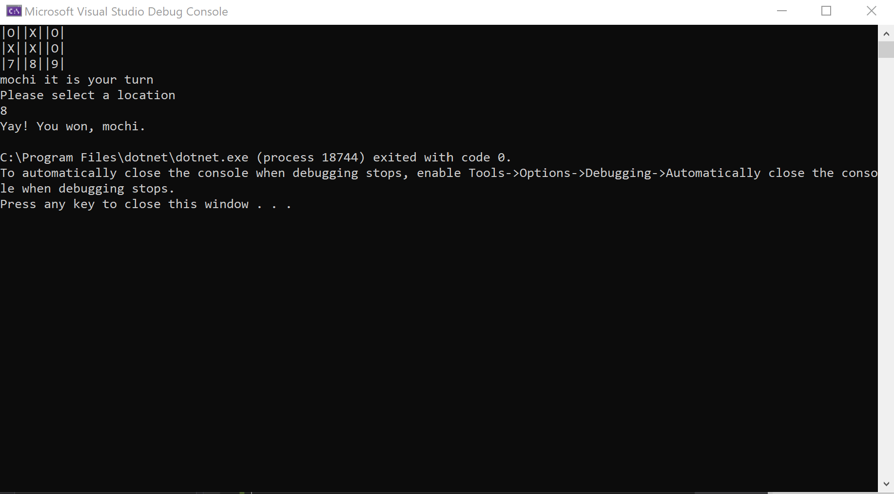

# TicTacToe

Lab04-ClassAndObjects

*Author: Allyson Reyes*

----

## Description
This is a C# console application game if the infamous TicTacToe game. 
The console asks for 2 users to play and their names. They each take turns choosing their positions.
Whoever has a 3 positions in a row first wins!

---

### Getting Started
1. Clone this repository to your local machine.

```
$ git clone [https://github.com/areyes986/ClassAndObjects.git]
```

2. Then inside your terminal, make sure you are inside the folder of the cloned repo and find `program.cs`.

3. Still inside your terminal, run `dotnet run`.


---

### Visuals

#### Application Start
  
As soon as you open the console, this is what you will see. The console will ask for the first players name.  
#### Using the Application
  
After the user inputs their name, it asks for the second players name. 
In this case, the first player is named Mochi and the second player is named Kudo  

  
The way the users input their desired spot is by entering the number of the corresponding positon they wish to mark.  

  
In the prior photo, we saw that Mochi chose position 5. After he chose and pressed enter, the corresponding area shows his "X" mark.  
#### Application End
  
Here we see the back and forth between the players and we saw that Mochi won and the game is ended.

---

### Change Log
1.4: *Added in summaries and finished readme* - 3/23/2020  
1.3: *Finished the general app on program.cs* - 3/23/2020  
1.2: *Added in 3 unit testings* - 3/23/2020  
1.1: *General set up and initial commit with start code and gitignore* - 3/23/2020 


------------------------------
